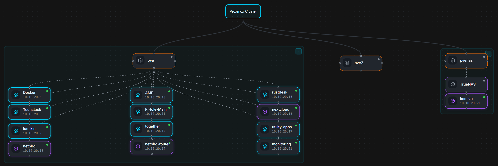

As my homelab has grown, keeping track of the relationships between physical hosts, virtual machines, containers, network infrastructure, storage, and applications has become increasingly important.

I already maintain written documentation through GitHub and this Technical Lab Journal, but written documentation does not always provide the quickest way to understand how everything fits together.

I wanted something more visual.

That led me to **Homelabel**, a self-hosted application designed to document and visualize homelab infrastructure.

After deploying it and connecting it to my Proxmox environment, I used it to create several high-level infrastructure views that make it much easier to understand the lab at a glance.

## Why Add Another Documentation Tool?

I already have several forms of documentation for the lab.

My GitHub repository contains structured technical documentation.

The Technical Lab Journal records projects, troubleshooting, architecture decisions, and lessons learned.

I also maintain dashboards for operational monitoring.

Each serves a different purpose.

```text
GitHub
   │
   └── Structured technical documentation

Technical Lab Journal
   │
   └── Projects, troubleshooting, and lessons learned

Grafana / Home Assistant
   │
   └── Live operational visibility

Homelabel
   │
   └── Visual infrastructure relationships
```

What I was missing was a convenient way to create and maintain visual representations of the environment without manually drawing every diagram from scratch.

That is where Homelabel fit well.

## Deploying Homelabel

I deployed Homelabel alongside other smaller applications in my existing Docker-based utility environment.

The application uses separate frontend and backend components, which made validating the deployment straightforward.

My initial goal was simply to confirm that both components were healthy and that the web interface could communicate correctly with the backend.

Once the application was running, I verified the frontend independently before moving on to integrations.

That follows the same deployment process I use for most self-hosted applications:

```text
Deploy Containers
      │
      ▼
Verify Services
      │
      ▼
Test Web Interface
      │
      ▼
Configure Integration
      │
      ▼
Build Documentation
```

Separating those stages makes troubleshooting easier because application problems can be resolved before introducing API authentication or external service discovery.

## Adding Reverse Proxy Access

Once Homelabel was working internally, I added it to my existing reverse proxy infrastructure.

This gave the application the same hostname-based access model I use for many other services in the lab.

I prefer this approach over remembering individual server addresses and ports because the application becomes another named service rather than another infrastructure endpoint I need to memorize.

From a usability standpoint, that means the service behaves like:

```text
Browser
   │
   ▼
Service Hostname
   │
   ▼
Reverse Proxy
   │
   ▼
Homelabel
```

The underlying application can remain inside the Docker environment while the reverse proxy provides the user-facing entry point.

## Connecting Homelabel to Proxmox

One of the features I was most interested in was Homelabel's ability to discover infrastructure directly from Proxmox.

Rather than manually entering every virtual machine and Linux container, I created a dedicated Proxmox API account for Homelabel.

The integration required:

- A dedicated API user
- An API token
- Appropriate permissions
- The Proxmox API endpoint
- Correct authentication information

I initially ran into an authentication issue because the API token information I was using had been truncated.

The connection looked correct at first, but discovery could not authenticate properly.

Rather than continuing to troubleshoot a potentially invalid credential, I generated a new token and configured the integration again.

Once the credentials were correct, Homelabel successfully connected to Proxmox and discovered the devices associated with the environment.

The discovery process identified **17 devices**, giving me a useful starting point instead of requiring every virtual machine and container to be recreated manually.

That was one of the biggest advantages of the application.

## Discovering Infrastructure Is Only the Beginning

Automatic discovery gives Homelabel information about the systems that exist, but discovery alone does not create useful documentation.

The next step was organizing those systems into diagrams that actually communicate something.

Instead of trying to create one enormous diagram containing every component in the lab, I decided to build several focused views.

That keeps each diagram readable and lets each one answer a specific question.

For example:

```text
Core Infrastructure
        │
        ├── Compute
        ├── Networking
        ├── Storage
        ├── Monitoring
        └── Automation

Proxmox Cluster
        │
        ├── pve
        ├── pve2
        └── pvenas
```

This approach is much more useful to me than trying to place every service, device, network, and dependency onto one canvas.

## Building the Core Infrastructure View

The first major diagram I created was a **Core Infrastructure** view.

This provides a high-level representation of the systems that form the foundation of the homelab.

Rather than focusing on every application, it emphasizes the platforms that other services depend on.

The diagram includes major components such as:

- Proxmox hosts
- OPNsense
- TrueNAS
- Home Assistant
- Docker-based infrastructure
- Monitoring services
- Backup infrastructure
- Core utility systems

The goal is not to expose every technical relationship.

It is to answer a simpler question:

> What are the major systems that make this homelab work?

That makes the diagram useful both as internal documentation and as a sanitized visual for my public portfolio.

## Documenting the Proxmox Cluster

I also created a separate diagram specifically for the Proxmox environment.



*The Proxmox Cluster view separates the virtualization environment from the broader infrastructure diagram and shows how workloads are distributed across the three hosts.*

My Proxmox environment currently consists of three hosts:

```text
            Proxmox Cluster
                  │
       ┌──────────┼──────────┐
       │          │          │
      pve        pve2      pvenas
```

Homelabel gives me a convenient way to visually associate important workloads with the physical systems hosting them.

That is particularly useful as the number of virtual machines and containers grows.

Instead of remembering where every service currently runs, I can maintain a visual representation of workload placement.

## Different Diagrams for Different Questions

One decision I made while building the diagrams was **not to force every piece of the homelab into Homelabel**.

For example, I experimented with representing equipment based on rack-unit placement.

That works well for hardware designed around standardized rack dimensions, but not everything in my environment maps cleanly to a U-by-U layout.

Trying to force every device into that format would make the documentation more complicated without necessarily making it more useful.

I decided to focus Homelabel primarily on **logical infrastructure relationships** instead.

That fits my environment much better.

The same principle applies to network documentation.

I maintain more detailed information about network segmentation separately, but I do not intend to expose the complete VLAN segmentation flow in this public documentation.

The public diagrams are deliberately designed to communicate the structure of the lab without exposing unnecessary operational details.

## Keeping Public Infrastructure Documentation Sanitized

Visual infrastructure documentation can accidentally reveal much more than expected.

A diagram can expose:

- Internal IP addresses
- Management networks
- VLAN relationships
- Firewall boundaries
- Administrative interfaces
- Internal hostnames
- Service placement
- Authentication architecture

Because of that, the diagrams I use publicly are intentionally selective.

The goal is to demonstrate the architecture and the technologies involved without publishing information someone would need to interact directly with the environment.

For this article, I specifically chose to show:

- Core infrastructure
- Proxmox cluster organization
- Major platform relationships

while leaving more detailed network segmentation documentation private.

That balance lets the diagrams remain technically meaningful while still being appropriate for a public portfolio.

## Why Visual Documentation Helps

Written documentation is extremely useful when I need details.

A diagram serves a different purpose.

For example, documentation might explain:

```text
What does this server do?
How is this application deployed?
How was this issue fixed?
What configuration does this service require?
```

A visual diagram helps answer:

```text
Where does this system fit?
What depends on what?
Which host runs this workload?
How is the environment organized?
```

Having both gives me a much more complete documentation system.

It also makes troubleshooting easier.

If a physical host is unavailable, I can quickly identify which workloads may be affected.

If I plan to move a service between hosts, the diagram provides context for its current placement.

If the environment changes, I have another place where that change needs to be documented.

## Documentation as Part of Operating the Lab

One thing my homelab has taught me is that documentation should not be something created only after a project is finished.

As infrastructure becomes more complicated, documentation becomes part of operating it.

The cycle increasingly looks like:

```text
Design
  │
  ▼
Deploy
  │
  ▼
Test
  │
  ▼
Document
  │
  ▼
Monitor
  │
  ▼
Change
  │
  └──────────────► Update Documentation
```

Homelabel gives me another useful tool for the documentation part of that cycle.

It does not replace GitHub documentation, architecture notes, dashboards, or the Technical Lab Journal.

Instead, it complements them.

## What Went Well

The strongest part of the Homelabel deployment was the Proxmox integration.

Once authentication was configured correctly, automatic discovery significantly reduced the amount of manual work required to begin documenting the virtualization environment.

The interface also made it easy to experiment with different layouts without permanently committing to one documentation style.

That helped me determine fairly quickly what worked for my environment and what did not.

Focused infrastructure diagrams worked well.

Trying to represent everything physically did not.

That experimentation helped define how I plan to use the application going forward.

## What Was Difficult

The biggest initial issue was API authentication.

Because the original Proxmox API token had been copied incorrectly, the integration initially failed even though the rest of the configuration appeared reasonable.

Generating a clean token resolved the issue and allowed discovery to work correctly.

The other challenge was more conceptual than technical.

A tool like Homelabel makes it tempting to document **everything**.

But more information does not automatically produce better documentation.

A diagram containing every service, every network, every dependency, and every physical device quickly becomes difficult to read.

The more useful approach was deciding what each diagram was supposed to communicate and only including the infrastructure relevant to that goal.

## What I Learned

The biggest takeaway from adding Homelabel was that good infrastructure documentation requires the same kind of design decisions as the infrastructure itself.

The tool makes it easy to draw relationships.

The harder question is deciding **which relationships are actually useful to show**.

My main takeaways were:

- Automatic discovery is useful, but discovered devices still need meaningful organization
- Separate diagrams are often better than one enormous topology
- Logical infrastructure views fit my environment better than forcing everything into physical rack-unit layouts
- API integrations should use dedicated credentials with appropriate permissions
- Public diagrams should be intentionally sanitized
- Detailed network segmentation does not need to be exposed for a diagram to demonstrate networking experience
- Visual documentation works best alongside written documentation rather than replacing it

## Final Result

Homelabel is now part of the documentation tooling I use to maintain my homelab.

The application gives me a visual layer that sits alongside the rest of my documentation:

```text
                    Homelab Documentation
                           │
          ┌────────────────┼────────────────┐
          │                │                │
        GitHub        Lab Journal       Homelabel
          │                │                │
          ▼                ▼                ▼
     Technical        Projects and       Visual
   Documentation     Troubleshooting    Relationships
```

The Core Infrastructure view gives me a clean overview of the major platforms supporting the environment, while the Proxmox Cluster view provides a more focused look at compute and workload placement.

Going forward, I can continue updating these diagrams as systems move, new services are added, and the lab evolves.

It is another relatively small self-hosted application, but it fills an important gap in the way I document the environment.

The lab is no longer just something I build.

It is something I am increasingly learning to **operate, monitor, secure, and document as an infrastructure environment**.