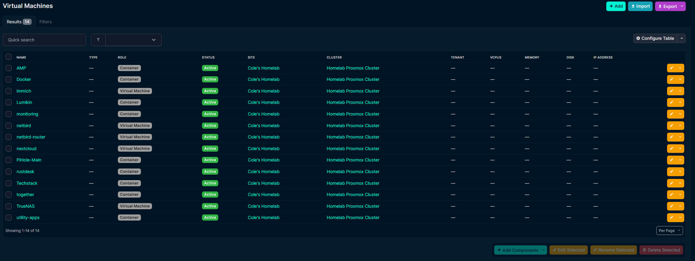
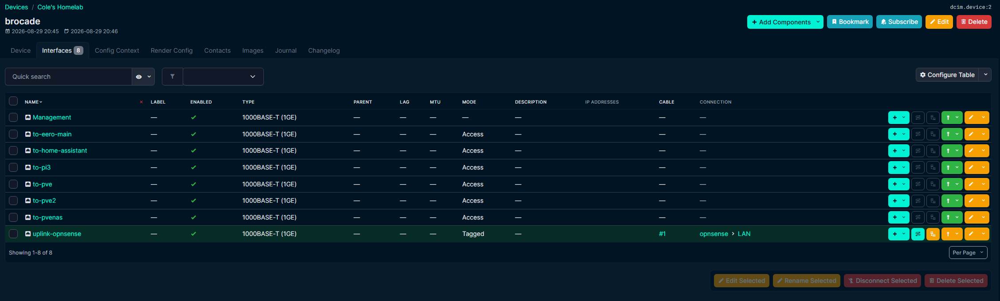
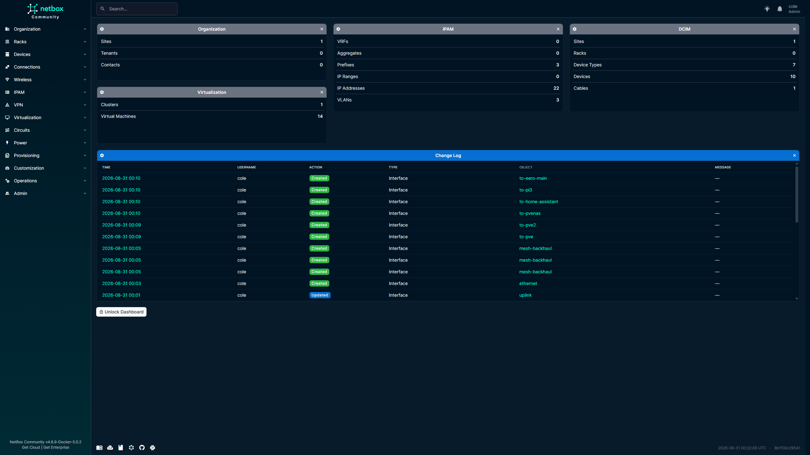

As my homelab has grown, keeping track of what exists has become almost as important as deploying the infrastructure itself.

What started as a handful of servers and services has grown into multiple Proxmox hosts, virtual machines, Linux containers, storage systems, networking equipment, wireless infrastructure, IP addressing, VLANs, physical connections, and self-hosted applications.

I already document the environment in several ways.

My GitHub repository contains structured public documentation, this Technical Lab Journal records projects and troubleshooting, and Homelabel gives me a convenient visual representation of infrastructure relationships.

What I was still missing was something more structured:

**a source of truth for the infrastructure itself.**

That led me to deploy **NetBox**.

## Why NetBox?

NetBox is different from most of the applications I run in the homelab.

It does not host media, monitor servers, provide DNS, or run an end-user service.

Instead, its purpose is to describe the infrastructure those services depend on.

That includes concepts such as:

- Sites
- Physical devices
- Device types
- Interfaces
- Cables
- Clusters
- Virtual machines
- IP addresses
- Prefixes
- VLANs
- Relationships between infrastructure objects

The goal is to create a structured representation of what the environment is supposed to look like.

That distinction is important.

A monitoring platform answers:

> What is happening right now?

A diagram answers:

> How are these systems related?

NetBox answers:

> What infrastructure exists, and how is it defined?

My documentation stack now looks roughly like this:

```text
GitHub
   │
   └── Structured public documentation

Technical Lab Journal
   │
   └── Projects, troubleshooting, and lessons learned

Homelabel
   │
   └── Visual topology and infrastructure relationships

Grafana / Home Assistant
   │
   └── Operational monitoring and status

NetBox
   │
   └── Infrastructure source of truth
```

Each tool overlaps slightly with the others, but each solves a different problem.

## Deploying NetBox

I deployed NetBox inside a dedicated Linux container in my Proxmox environment.

Rather than installing all of the application components directly on the operating system, I used Docker Compose to keep the deployment organized and repeatable.

The stack includes several services working together:

```text
Browser
   │
   ▼
NetBox Web
   │
   ├── PostgreSQL
   │
   ├── Cache / Queue Services
   │
   └── NetBox Worker
```

The environment uses:

- NetBox
- NetBox Worker
- PostgreSQL
- Valkey-backed cache and queue services
- Docker Compose

Once the containers were healthy, I verified that the NetBox web interface was reachable internally before moving on to the rest of the configuration.

This follows the same approach I use for most self-hosted deployments:

```text
Deploy
  │
  ▼
Verify Containers
  │
  ▼
Verify Application
  │
  ▼
Configure Access
  │
  ▼
Begin Modeling Infrastructure
```

Getting NetBox running was only the beginning.

The real work was deciding how to accurately model the homelab inside it.

## Adding Reverse Proxy Access

After verifying the application internally, I added NetBox to my existing reverse proxy environment.

That gave it a dedicated hostname and made the interface easier to access without remembering another server address and application port.

The request flow remains straightforward:

```text
Browser
   │
   ▼
NetBox Hostname
   │
   ▼
Reverse Proxy
   │
   ▼
NetBox
```

The application remains hosted internally while the reverse proxy provides the user-facing entry point.

This also keeps NetBox consistent with the way I access many of the other administrative applications in the lab.

## Starting with the Physical Infrastructure

Once NetBox was running, I began by defining the physical side of the environment.

That included equipment such as:

- Proxmox hosts
- Firewall/router
- Managed switch
- Storage infrastructure
- Home Assistant
- Raspberry Pi systems
- Wireless infrastructure

One of the first lessons was that NetBox requires more deliberate modeling than a basic inventory application.

It is not enough to create an object called "switch."

The value comes from describing how that switch fits into the rest of the infrastructure.

That means defining interfaces, connections, device roles, and relationships between devices.

## Modeling the Proxmox Cluster

Virtualization was one of the most important areas I wanted NetBox to represent.

I created a **Proxmox VE cluster** and associated the three physical Proxmox systems with it.

This gives me a logical object representing the cluster itself while still keeping each underlying physical host documented as a separate device.

At a high level:

```text
             Proxmox Cluster
                    │
         ┌──────────┼──────────┐
         │          │          │
       Host 1     Host 2     Host 3
```

The virtual workloads can then be associated with the cluster instead of treating every VM or container as an unrelated object.

This separation between **physical devices** and **virtual machines** is one of the areas where NetBox started to make more sense as I worked with it.

The physical server exists as a device.

The Proxmox environment exists as a cluster.

The workloads exist as virtual machines associated with that cluster.

That creates a much more structured model than simply maintaining a list of server names.

## Documenting Virtual Workloads

I then added the virtual machines and Linux containers running throughout the cluster.



*The virtualization inventory provides a structured view of the workloads associated with the Proxmox cluster without exposing their internal addressing.*

I used roles to distinguish between traditional virtual machines and container-based workloads.

The inventory now provides a quick way to answer questions such as:

- What workloads currently exist?
- Which virtualization cluster do they belong to?
- Is the workload active?
- Is it a virtual machine or container?
- Which site does it belong to?

This is different from Proxmox itself.

Proxmox remains the platform I use to actually operate the virtual infrastructure.

NetBox records what that infrastructure is supposed to contain.

That distinction becomes more valuable as the environment grows.

## Modeling Network Interfaces

Networking introduced another layer of detail.

A physical device in NetBox can have interfaces, and those interfaces can represent both physical and logical relationships.

This made it possible to model things such as:

- Physical Ethernet connections
- Management interfaces
- Switch uplinks
- Server connections
- Virtual interfaces
- Parent and child interface relationships
- Tagged and untagged network behavior

Working through these concepts required me to think more carefully about the difference between the physical topology and the logical network configuration.

For example, a firewall may have one physical LAN connection while multiple logical network interfaces exist above it.

NetBox gives me a place to represent those relationships without treating every interface as an unrelated connection.

## Documenting the Managed Switch

The managed switch became one of the most useful devices to model in detail.



*Switch interfaces are documented with descriptive names and physical cable relationships so the role of each connection is clear without publishing the detailed VLAN segmentation design.*

Rather than leaving switch ports with only generic interface identifiers, I documented their purpose using descriptive names.

That gives me a much more useful inventory when I need to answer questions like:

- Which port connects to a Proxmox host?
- Which connection is the firewall uplink?
- Where is a particular infrastructure device connected?
- Which switch interfaces are currently in use?

This is especially useful because physical cabling is easy to forget once everything has been running for a while.

Without documentation, troubleshooting can eventually turn into physically tracing cables through the rack.

With NetBox, the intended relationship is recorded ahead of time.

## Adding Physical Cables

NetBox also allows interfaces to be connected using explicit cable objects.

I started using this to represent the physical relationship between devices rather than simply naming ports.

Conceptually:

```text
Firewall Interface
       │
       │ Cable
       ▼
Managed Switch
       │
       ├── Proxmox Host
       ├── Proxmox Host
       ├── Proxmox / Storage Host
       ├── Home Assistant
       └── Other Infrastructure
```

The important part is not creating a visually impressive topology.

It is having a structured record of where a physical connection begins and where it terminates.

That information becomes particularly useful during hardware replacement, troubleshooting, or network changes.

## Using NetBox for IPAM

Another major part of NetBox is **IP Address Management**, or IPAM.

I began documenting the addressing structure used throughout the environment.

NetBox can track objects such as:

- Prefixes
- IP addresses
- VLANs
- Interface assignments

This gives me a centralized place to record addressing information rather than relying on memory, DHCP configuration, DNS records, or scattered notes.

The goal is not for NetBox to replace DHCP or DNS.

Instead:

```text
DHCP
   └── Assigns network configuration

DNS
   └── Resolves names

NetBox
   └── Documents intended addressing
```

That makes NetBox useful as a reference when working on other systems.

If I need to understand where an address belongs or how a network is intended to be used, I have one structured place to check.

## Choosing What Not to Publish

NetBox can contain much more information than I want to expose publicly.

That includes details such as:

- Internal IP addressing
- Prefixes and subnet boundaries
- VLAN IDs and names
- Network segmentation relationships
- Interface assignments
- Management paths
- Internal service addressing
- Detailed cabling information

Because of that, the screenshots used in this article are intentionally selective.

I am comfortable showing that the environment contains IPAM records and VLAN documentation.

I am not publishing the complete VLAN segmentation flow or enough information to reconstruct the internal network design.

That is an important distinction for public infrastructure documentation.

The goal is to demonstrate that I understand and maintain the architecture, not to publish every operational detail required to access or reproduce it.

## Devices Versus Virtual Machines

One concept that became clearer while building the NetBox environment was the difference between a **device** and a **virtual machine**.

At first glance, both represent systems running in the lab.

But NetBox treats them differently for a reason.

A physical Proxmox server is a device.

A VM running on Proxmox is a virtual machine.

A storage server may be a physical device while the storage operating system itself may run as a virtualized workload.

Understanding those relationships helped me model the environment more accurately instead of forcing every system into the same category.

The hierarchy increasingly looks like:

```text
Physical Infrastructure
        │
        ▼
Virtualization Platform
        │
        ▼
Virtual Machines / Containers
        │
        ▼
Applications and Services
```

NetBox primarily documents the infrastructure layers rather than every individual application running inside them.

## NetBox Versus Homelabel

Deploying NetBox shortly after Homelabel also highlighted the difference between the two tools.

Homelabel is excellent for answering:

> How do I want to visualize my infrastructure?

NetBox is better suited for answering:

> What exactly exists in my infrastructure?

Homelabel lets me create a clean visual like:

```text
Internet
   │
Firewall
   │
Switch
   │
Infrastructure
```

NetBox stores the structured information behind those relationships:

```text
Device
  │
Interface
  │
Cable
  │
Interface
  │
Device
```

I do not see one replacing the other.

Instead, they complement each other.

Homelabel provides a visual overview.

NetBox provides the detailed source of truth.

## Building a More Useful Dashboard

After populating the environment, I also customized the NetBox dashboard.



*The customized dashboard provides a quick summary of the infrastructure currently documented in NetBox across physical devices, virtualization, IPAM, and recent changes.*

The default dashboard contained several widgets that were not particularly useful for my environment.

I removed the ones I did not need and focused the layout around:

- Organization
- DCIM
- IPAM
- Virtualization
- Recent changes

This gives me a quick indication of how much of the environment is represented in NetBox.

More importantly, it provides an easy way to notice when the documentation is becoming stale.

If I deploy something new and NetBox still shows the same inventory, that is a reminder that the source of truth needs to be updated.

## Documentation Drift

That leads to what may be the most important challenge with a tool like NetBox:

**it is only useful if I keep it current.**

Deploying NetBox does not automatically solve infrastructure documentation.

If I create a VM in Proxmox but never add it to NetBox, the source of truth is already wrong.

If I move a cable and do not update the connection, the physical documentation becomes stale.

If I change addressing but never update IPAM, the data can no longer be trusted.

The workflow needs to become:

```text
Plan Change
    │
    ▼
Update Infrastructure
    │
    ▼
Validate Change
    │
    ▼
Update NetBox
```

Eventually, I would like to move even closer to:

```text
NetBox
   │
   ▼
Source of Truth
   │
   ▼
Infrastructure Automation
```

I am not at that stage yet, but establishing accurate data is the first requirement for eventually using NetBox as part of automation workflows.

## What Went Well

Once I understood the NetBox object model, documenting the environment became increasingly straightforward.

The areas that worked particularly well were:

- Creating a structured Proxmox cluster
- Associating physical hosts with the cluster
- Separating virtual machines from physical devices
- Documenting switch interfaces
- Recording physical cable relationships
- Adding IPAM information
- Creating logical interface relationships
- Customizing the dashboard around the infrastructure I actually use

NetBox also forced me to think about the lab in a more structured way.

Instead of saying:

> This cable goes to that server.

I need to define:

```text
Device
  │
Interface
  │
Cable
  │
Interface
  │
Device
```

That extra structure is exactly what makes the resulting documentation useful.

## What Was Difficult

The hardest part was not installing NetBox.

It was learning how NetBox expects infrastructure to be represented.

Several concepts required more thought than I initially expected:

- Devices versus virtual machines
- Physical versus logical interfaces
- Parent and child interfaces
- Cable terminations
- Tagged versus untagged network behavior
- VLAN relationships
- Where addressing information belongs
- How much detail is actually worth documenting

There were several points where the technically possible configuration was not necessarily the best documentation model.

That required stepping back and asking:

> What does this object represent in the real infrastructure?

Once I started thinking that way, NetBox became much easier to understand.

## What I Learned

The biggest lesson from this project is that a **source of truth requires intentional modeling**.

Installing NetBox is easy compared with deciding how the infrastructure should be represented inside it.

My main takeaways were:

- Infrastructure inventory becomes more valuable when relationships are documented
- Physical devices and virtual workloads should be modeled differently
- Interfaces are critical to accurately representing networking
- Cable documentation can save significant troubleshooting time later
- IPAM provides value even when DHCP and DNS already exist
- A source of truth must be maintained as infrastructure changes
- Not every detail stored in NetBox belongs in public documentation
- Structured data and visual diagrams serve different purposes
- NetBox becomes more valuable as the environment becomes more complex

## Final Result

NetBox is now serving as a structured source of truth for the major infrastructure in my homelab.

It contains information about:

- Physical infrastructure
- Proxmox hosts
- Virtual machines and containers
- Network interfaces
- Physical connections
- IP addressing
- Network prefixes
- VLANs
- Infrastructure relationships

My overall documentation environment now looks like:

```text
                    Homelab Infrastructure
                            │
          ┌─────────────────┼─────────────────┐
          │                 │                 │
        NetBox          Homelabel         Monitoring
          │                 │                 │
          ▼                 ▼                 ▼
    Source of Truth    Visual Topology    Live Status
          │
          │
          ├──────────► GitHub
          │              │
          │              ▼
          │       Public Documentation
          │
          └──────────► Technical Lab Journal
                         │
                         ▼
                Projects / Troubleshooting
```

NetBox does not replace any of the other tools I use.

Instead, it gives those tools something I was missing: a structured representation of what the infrastructure actually contains.

The next challenge is not deploying more features.

It is making sure the information stays accurate as the homelab continues to change.

That is probably the clearest sign that the environment has evolved beyond simply self-hosting applications.

I am increasingly treating it like infrastructure that needs to be **designed, operated, monitored, secured, backed up, and documented intentionally**.