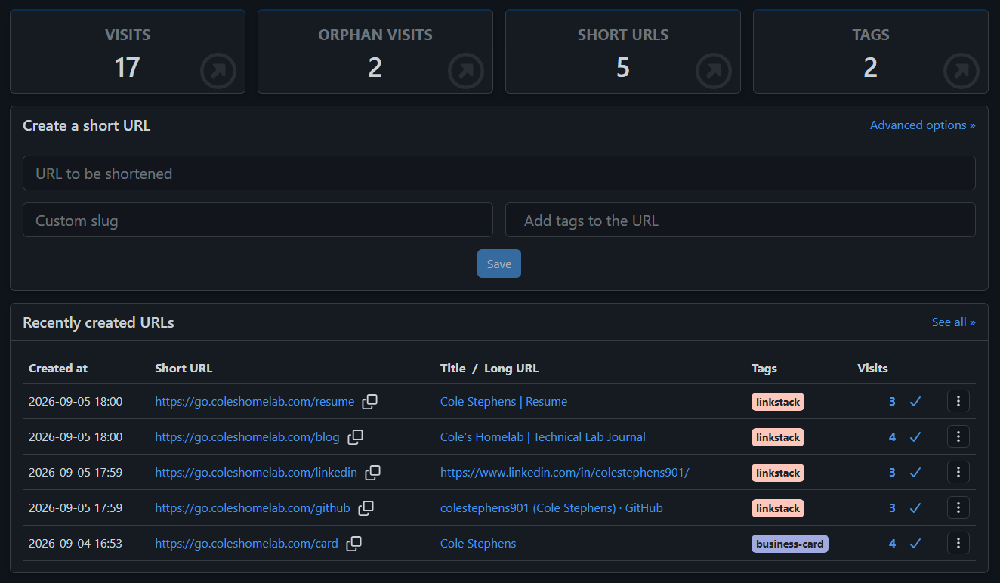

Over the last several weeks, I have been putting more effort into the public side of my homelab.

What started as infrastructure documentation on GitHub has gradually expanded into several resources that each serve a different purpose:

- My Technical Lab Journal
- My resume site
- My LinkStack landing page
- GitHub
- LinkedIn

Once those pieces were in place, I started thinking about something I had not previously needed to worry about:

**How do I know whether anyone is actually using them?**

My existing monitoring stack can tell me whether a website is online, whether a server is healthy, or whether a container is running.

It cannot tell me which links people are clicking, which pages they are visiting, or how they interact with the public-facing side of my portfolio.

I wanted that visibility while keeping as much of the analytics infrastructure self-hosted as possible.

That led me to deploy two additional applications:

- **Shlink** for branded short URLs and click tracking
- **Umami** for website analytics

Together, they give me a much better picture of how visitors reach and interact with the different parts of my technical portfolio.

## Two Tools for Two Different Problems

Shlink and Umami both provide analytics, but they measure different parts of the visitor journey.

Shlink focuses on the link itself.

Umami focuses on what happens after someone reaches the website.

At a high level:

```text
Visitor
   │
   ▼
Short URL
   │
   ▼
Shlink
   │
   ├── Records Visit
   │
   ▼
Destination Website
   │
   ▼
Umami
   │
   ├── Records Visitor
   ├── Records Page Views
   ├── Tracks Navigation
   └── Measures Engagement
```

Using both gives me visibility into two different questions:

```text
Shlink
   └── How did someone get there?

Umami
   └── What happened after they arrived?
```

That distinction is what made deploying both applications worthwhile.

## Why I Wanted Shlink

As I started sharing my blog, resume, GitHub profile, LinkedIn profile, and LinkStack page more frequently, I wanted something cleaner than distributing long destination URLs everywhere.

I also wanted the ability to track those links and change their destinations later without changing the URL I had originally shared.

That made Shlink a good fit.

I configured a dedicated short-link domain:

```text
go.coleshomelab.com
```

Instead of sharing the full destination URL, I can now use simple branded addresses such as:

```text
go.coleshomelab.com/card
go.coleshomelab.com/github
go.coleshomelab.com/linkedin
go.coleshomelab.com/blog
go.coleshomelab.com/resume
```

These are much easier to remember and much more useful for places where a short, permanent URL matters.

## Building the Short-Link Layer

I created five primary links for the resources I currently share most often.



*Shlink provides branded URLs for the public resources I share most often while recording visits to each destination.*

The links currently cover:

- Resume
- Technical Lab Journal
- LinkedIn
- GitHub
- Business card / landing page

I also use tags to help identify how certain links are being used.

For example, the links associated with my LinkStack page can be grouped separately from a link intended for a physical business card.

That gives me another way to organize the analytics as the number of links grows.

## Why Short Links Are More Than Shorter URLs

The part of Shlink I find most useful is not actually the shortening.

It is the abstraction between the public URL and the final destination.

For example:

```text
Printed QR Code
      │
      ▼
go.coleshomelab.com/card
      │
      ▼
Current Destination
```

If I later decide that `/card` should point somewhere different, I can change the destination in Shlink.

The public URL does not change.

That means:

- The QR code still works
- Printed materials do not need to be replaced
- Existing links remain valid
- I can change the destination without redistributing anything

This is especially useful for something physical like a business card.

Once a QR code is printed, I do not want the destination permanently tied to a URL I may eventually replace.

Shlink gives me a stable layer between the printed link and whatever destination I want to use in the future.

## Integrating Shlink with LinkStack

My LinkStack page acts as the front door to the different parts of my public technical presence.

It currently provides links to resources including:

- GitHub
- LinkedIn
- Technical Lab Journal
- Resume

Instead of pointing those buttons directly to their final destinations, I can route them through Shlink.

The flow becomes:

```text
LinkStack
   │
   ▼
Shlink
   │
   ▼
Destination
```

From the visitor's perspective, nothing really changes.

They click the button and arrive at the expected site.

Behind the scenes, Shlink records that the link was used.

This is already useful because it lets me see which resources on the LinkStack page are actually receiving attention.

## Deploying Shlink

I deployed Shlink as another Docker-based application in the homelab.

The stack includes:

- Shlink
- PostgreSQL
- Shlink Web Client

Conceptually:

```text
Management Browser
        │
        ▼
Shlink Web Client
        │
        ▼
     Shlink API
        │
        ▼
     PostgreSQL
```

The public short URLs use the Shlink backend for redirects while the web client gives me the administrative interface for creating and managing them.

I also ran into a small practical issue during deployment: the original ports I planned to use conflicted with services already running on the Docker host.

Rather than restructuring existing applications, I moved the Shlink API and web interface to available ports and continued the deployment.

It was a small problem, but a realistic example of what happens when a Docker host gradually accumulates more services.

Port planning becomes part of operating the environment.

## Publishing the Short-Link Domain

The public redirect domain is:

```text
go.coleshomelab.com
```

I configured the DNS and public access path so the short URLs can be reached externally while the Shlink service continues running inside my own environment.

The public-facing flow is roughly:

```text
Visitor
   │
   ▼
go.coleshomelab.com
   │
   ▼
Cloudflare
   │
   ▼
Shlink
   │
   ▼
Destination
```

This gives me a branded domain while keeping the actual redirect platform self-hosted.

## Adding Umami

Shlink tells me when someone uses one of my short URLs.

That still leaves another question:

> What happens after the redirect?

For that, I deployed **Umami**.

Umami is a self-hosted web analytics platform that provides the kind of basic visitor and engagement information I was looking for without requiring me to add a much larger advertising-focused analytics platform.

I made the administrative interface available through:

```text
analytics.coleshomelab.com
```

I then added Umami tracking to the three public websites I currently care about most:

- `links.coleshomelab.com`
- `blog.coleshomelab.com`
- `resume.coleshomelab.com`

After adding the tracking code, I verified that all three were successfully reporting data.

## One Dashboard for the Public Portfolio

The finished Umami dashboard gives me a single place to see activity across all three sites.

The LinkStack page can be compared with the Technical Lab Journal and resume site without logging into three different analytics systems.

The metrics include things such as:

- Visitors
- Visits
- Views
- Bounce rate
- Visit duration
- Page activity

This gives me much more context than simply knowing that a site is online.

For example:

```text
Uptime Monitoring
      │
      ▼
"The blog is reachable."
```

compared with:

```text
Umami
   │
   ▼
"Someone visited the blog,
viewed several pages,
and spent time reading it."
```

Both are useful, but they answer completely different questions.

## Following the Visitor Journey

The most interesting part of using Shlink and Umami together is being able to see more of the complete path a visitor takes.

A simplified example might look like this:

```text
LinkedIn
   │
   ▼
go.coleshomelab.com/blog
   │
   ▼
Shlink Records Visit
   │
   ▼
Technical Lab Journal
   │
   ▼
Umami Records Visitor
   │
   ▼
Article Views
```

Another example could begin with LinkStack:

```text
links.coleshomelab.com
        │
        ▼
Visitor Clicks Resume
        │
        ▼
go.coleshomelab.com/resume
        │
        ▼
Shlink Records Visit
        │
        ▼
resume.coleshomelab.com
        │
        ▼
Umami Records Activity
```

Neither system individually gives me that entire picture.

Together, they provide a much more complete analytics layer.

## Measuring the Portfolio Instead of Guessing

Before adding analytics, I had no real way to know which parts of the portfolio were useful.

I could share a blog article on LinkedIn, but I would not know whether someone actually visited it.

I could add GitHub to LinkStack, but I would not know whether anyone clicked the button.

I could put a QR code on a business card, but I would not know whether anyone ever scanned it.

Now I can begin answering questions like:

- Which LinkStack buttons receive the most clicks?
- Is the Technical Lab Journal actually being visited?
- Are people looking at the resume site?
- Does a business card QR code generate traffic?
- Which short links receive the most visits?
- Which pages on the blog receive attention?

I am still working with very early traffic numbers, but having the data available is much more useful than simply guessing.

## Early Results

One thing I like about documenting this project now is that the systems are already recording real traffic.

The Shlink dashboard is showing visits across all five short URLs rather than simply displaying a freshly installed empty interface.

Umami is also collecting activity from all three public sites.

That makes this feel like an actual working platform rather than an installation experiment.

The analytics will become more useful over time as I continue sharing the Technical Lab Journal, GitHub projects, resume, and LinkStack page.

## Privacy and Self-Hosted Analytics

Another reason Umami appealed to me was the ability to keep the analytics platform under my control.

I do not need the depth of a large advertising or marketing analytics system.

The questions I care about are relatively simple:

- Are people visiting?
- What are they viewing?
- Where are they arriving from?
- Which resources seem useful?
- How long are they staying?

For that use case, a lightweight self-hosted platform makes sense.

The basic architecture remains:

```text
Visitor
   │
   ▼
My Website
   │
   ▼
My Analytics Platform
```

rather than adding another large third-party tracking service into the path.

Self-hosting does not remove the responsibility to think about privacy.

It does, however, give me much more control over what analytics infrastructure I operate and why I am operating it.

## Analytics Versus Infrastructure Monitoring

This project also helped clarify the distinction between **observability of infrastructure** and **analytics of users**.

I already monitor things like:

- Server availability
- CPU utilization
- Memory usage
- Storage capacity
- Backups
- Application uptime
- Environmental conditions

Those systems tell me whether the infrastructure is healthy.

Shlink and Umami tell me whether the public-facing services are actually being used.

The two layers now look something like this:

```text
Infrastructure Monitoring
        │
        ├── Prometheus
        ├── Grafana
        ├── Uptime Monitoring
        └── Home Assistant
             │
             ▼
       "Is it working?"


Portfolio Analytics
        │
        ├── Shlink
        └── Umami
             │
             ▼
       "Is it being used?"
```

That distinction makes both kinds of data more meaningful.

## Creating a Feedback Loop

The part I am most interested in long term is using analytics to improve the documentation itself.

The cycle now looks like:

```text
Build Infrastructure
        │
        ▼
Document Infrastructure
        │
        ▼
Publish Documentation
        │
        ▼
Share Documentation
        │
        ▼
Measure Engagement
        │
        ▼
Improve Documentation
```

If certain project write-ups consistently receive more traffic, that tells me what visitors may find interesting.

If a LinkStack button receives almost no clicks, maybe it is not as useful as I expected.

If people reach the blog but immediately leave, that could indicate something about the presentation or content.

The analytics do not make those decisions for me, but they give me data I did not previously have.

## The Public Side of the Homelab Is Becoming Its Own Platform

One of the more interesting outcomes of this project is realizing how much infrastructure now exists around the public portfolio itself.

It currently includes:

```text
                     Public Portfolio
                           │
          ┌────────────────┼────────────────┐
          │                │                │
       LinkStack      Lab Journal       Resume Site
          │                │                │
          └──────────┬─────┴──────┬─────────┘
                     │            │
                  Shlink        Umami
                     │            │
                     ▼            ▼
               Link Tracking   Analytics
```

Those services sit on top of other infrastructure including:

- Docker
- DNS
- Cloudflare
- Reverse proxying
- Public domains
- Monitoring
- Backups

What began as a few public links is gradually becoming a small self-hosted platform of its own.

## What Went Well

The biggest success was how naturally the two tools complement each other.

Shlink quickly gave me:

- Branded short URLs
- Editable redirect destinations
- Visit tracking
- Tags
- Better URLs for QR codes and printed material

Umami added:

- Visitor counts
- Visits
- Page views
- Visit duration
- Bounce rate
- Per-page activity
- Multiple-site analytics

I was also able to verify that all three public websites were successfully reporting data.

The LinkStack integration with Shlink was particularly satisfying because it adds analytics without changing the experience for the visitor.

## What Was Difficult

Neither application was especially difficult to install on its own.

Most of the challenge came from integrating them into an environment that already has a lot of moving pieces.

That includes:

- Docker services
- Existing port assignments
- Public DNS
- Cloudflare
- Internal DNS
- Reverse proxying
- Multiple subdomains
- Public websites

The Shlink deployment in particular required adjusting ports because of conflicts with other services already running on the host.

The larger lesson was familiar:

**installing an application is often the easiest part of self-hosting it.**

The more interesting work happens when the application has to fit cleanly into everything that already exists.

## What I Learned

The biggest lesson from this project is that link tracking and web analytics provide different kinds of visibility, and using both together is much more useful than either platform alone.

My main takeaways were:

- Short URLs are valuable for more than shortening links
- A permanent short URL can point to changing destinations
- Redirect links are especially useful for QR codes and printed materials
- Shlink works well as a tracking layer underneath LinkStack
- Umami provides useful analytics without requiring a large external platform
- Analytics and uptime monitoring answer fundamentally different questions
- Existing Docker environments require careful port planning
- DNS and public routing become increasingly important as more services share the same domain
- Analytics are most useful when they answer specific questions
- Self-hosting the public portfolio can extend beyond simply hosting the websites themselves

## Final Result

Shlink and Umami are now part of the public-facing infrastructure surrounding my homelab.

Shlink handles:

```text
Branded URLs
     +
Redirects
     +
Visit Tracking
     +
QR-Friendly Links
```

Umami handles:

```text
Visitors
    +
Visits
    +
Page Views
    +
Engagement
```

Together:

```text
Visitor
   │
   ▼
Shlink
   │
   ▼
Public Portfolio
   │
   ▼
Umami
   │
   ▼
Analytics
```

The result is a self-hosted analytics layer that sits behind the portfolio I have been building.

I now control the LinkStack landing page, Technical Lab Journal, resume site, short-link platform, and analytics platform connecting them.

That makes this project feel like more than simply deploying two additional applications.

It is another step toward treating the public side of my homelab with the same approach I use for the infrastructure behind it:

**build it, integrate it, monitor it, measure it, document it, and keep improving it.**