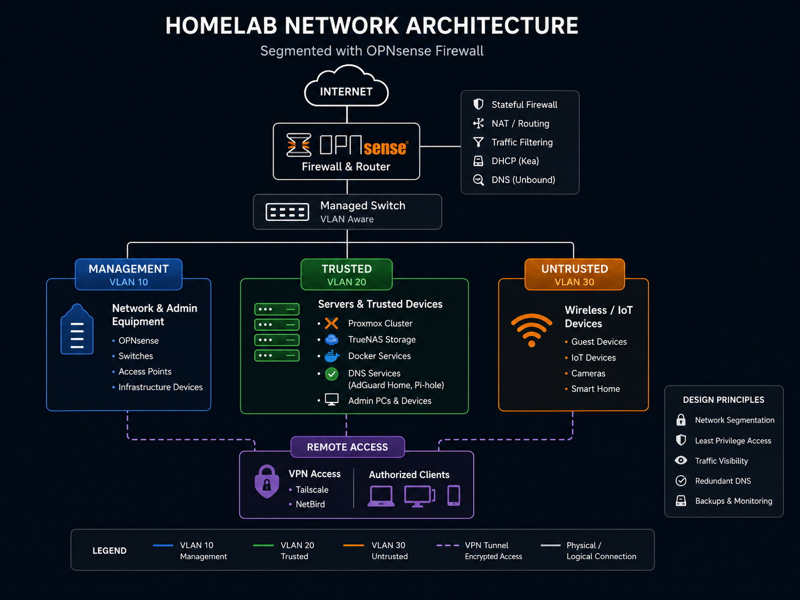
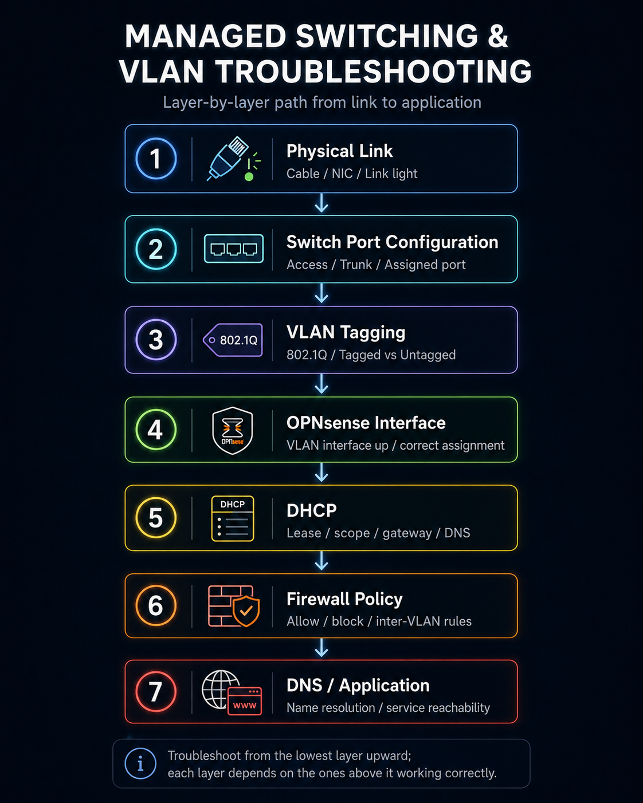
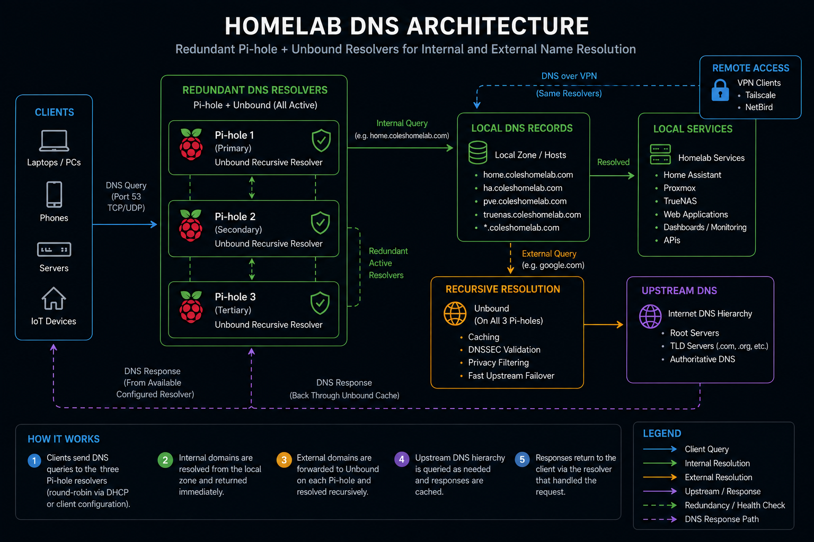

## Overview

As my homelab grew, keeping every device on a single flat network stopped making sense.

Servers, administrative devices, wireless clients, smart-home equipment, and infrastructure management interfaces have different security and access requirements. I wanted a network design that reflected those differences rather than allowing every device to communicate freely with everything else.

I redesigned the environment around **OPNsense**, VLAN segmentation, firewall policies, managed switching, internal DNS, and controlled remote access.

The goal was not simply to create more networks. It was to understand how routing and policy could be used to deliberately control communication between different classes of devices.

## Goals

The network redesign had several requirements:

* Separate infrastructure management from ordinary clients
* Keep trusted systems isolated from less-trusted wireless and IoT devices
* Control communication between network segments with firewall rules
* Maintain access to internal services through DNS names
* Provide centralized DHCP and DNS services
* Allow specific administrative devices to cross network boundaries when necessary
* Preserve secure remote administration through VPN access
* Maintain visibility into network activity and security events

## Network Design

I divided the environment into several logical network segments based on device role.

### Management

The management network contains infrastructure interfaces and systems that should not normally be accessible from general-purpose devices.

Examples include:

* firewall management
* switch management
* hypervisor administration
* infrastructure interfaces

Access to this network is intentionally limited.

### Trusted

The trusted network contains servers and systems that provide services to the rest of the environment.

Examples include:

* virtualization hosts
* Linux servers
* storage services
* monitoring platforms
* internal application servers

### Untrusted / Client Network

Wireless clients, smart-home equipment, and devices that do not need unrestricted access to server infrastructure are placed into a separate segment.

This provides a useful security boundary between ordinary endpoint devices and the systems responsible for running the homelab.

The high-level architecture looks like this:

*High-level homelab network architecture showing OPNsense routing and firewalling between Management, Trusted, and Untrusted network segments while providing secure remote access through VPN services.*

OPNsense routes between these networks, but routing alone does not imply permission to communicate.

Firewall rules determine what traffic is actually allowed.

## Firewall Policy

One of the most important lessons from this project was understanding the difference between **routing** and **authorization**.

Once OPNsense has interfaces for each VLAN, it is capable of routing traffic between them.

That does not mean every network should be allowed to communicate freely.

I designed firewall policy around the principle that traffic should be permitted when there is a defined reason for it rather than allowing broad access by default.

For example, ordinary client devices generally do not need unrestricted access to infrastructure management interfaces.

Administrative devices, however, may need controlled access to:

* Proxmox management
* OPNsense
* storage administration
* monitoring systems
* SSH
* internal web interfaces

This resulted in a policy model where specific trusted administrative devices are granted additional access without opening the same paths to the entire client network.

## Managed Switching and VLANs

The physical switching layer uses a managed switch capable of carrying multiple VLANs.

Links between the firewall, switch, and virtualization infrastructure can carry tagged traffic for multiple networks, while individual access ports can be assigned to the appropriate network depending on the connected device.

This allowed a single physical switching environment to support several logically isolated networks.

Understanding tagged and untagged traffic was an important part of the project because a configuration error at the switch can look very similar to a firewall or DHCP problem.

Troubleshooting therefore often involves checking several layers:

*The troubleshooting path I use when diagnosing VLAN connectivity issues, working from the physical layer upward before moving on to routing, policy, DNS, or the application itself.*

## DHCP

OPNsense provides centralized DHCP services for the network.

Each network segment has its own address scope and configuration.

This allows clients joining a VLAN to automatically receive the correct:

* IP configuration
* gateway
* DNS servers
* network-specific options

Using separate DHCP scopes also makes it easier to reason about where a device belongs based on the address it receives.

## DNS Architecture

Internal DNS plays an important role in the environment because I prefer accessing services by hostname rather than remembering addresses.

The DNS environment combines local recursive resolution with filtering and internal records.

Internal service names can resolve directly to private infrastructure while ordinary Internet domains continue through the normal DNS path.

A high-level DNS request looks like:

*DNS requests use redundant Pi-hole resolvers backed by Unbound. Internal hostnames resolve directly to local services, while public queries are resolved recursively through the public DNS hierarchy.*

This became especially useful for services accessed through an internal reverse proxy.

Instead of remembering individual addresses and ports, applications can be reached through consistent service names.

## Split DNS

Some services use the same parent domain internally and externally.

For internally hosted applications, DNS can return the private reverse-proxy address so traffic remains inside the local network.

This avoids unnecessary external routing and allows internal applications to use valid HTTPS hostnames.

The design required additional care once I began hosting some services outside the homelab.

A good example is a publicly hosted static site. That hostname must be allowed to resolve through public DNS instead of being captured by the internal wildcard used for self-hosted applications.

This reinforced an important lesson:

> Split DNS is extremely useful, but wildcard rules should always account for exceptions.

## Remote Administration

Remote access is provided through encrypted VPN connectivity.

The goal is for an authorized remote device to behave similarly to an administrative device inside the network without exposing management interfaces directly to the Internet.

Remote access therefore depends on several systems working together:

* VPN connectivity
* routing
* firewall rules
* internal DNS
* device policy

I intentionally avoid directly exposing interfaces such as hypervisor, firewall, or storage administration panels to the public Internet.

## Intrusion Detection

OPNsense also provides network security monitoring through an IDS/IPS implementation.

This adds visibility into potentially suspicious traffic and provides another opportunity to learn how network security tools behave in a real environment.

One lesson from enabling security monitoring is that detection systems require tuning.

A large number of alerts does not automatically mean a large number of attacks. Understanding the traffic and determining which alerts are meaningful is more useful than simply enabling every rule.

## Troubleshooting Approach

Network segmentation creates stronger boundaries, but it also introduces more places where something can fail.

When a device cannot reach a service, I work through the path systematically.

### 1. Confirm addressing

Verify that the client received an address from the expected network.

### 2. Confirm the gateway

Check that the client is using the correct OPNsense interface as its gateway.

### 3. Test routing

Determine whether the destination network can be reached at all.

### 4. Inspect firewall policy

Confirm whether OPNsense is allowing or blocking the traffic.

### 5. Test DNS independently

Determine whether the hostname resolves to the expected destination.

### 6. Test the application

Only after the underlying network path works do I move up to troubleshooting the application itself.

This layered process prevents application troubleshooting from masking an underlying network problem.

## What I Learned

Building a segmented network changed the way I think about networking.

A flat home network mostly hides concepts such as routing boundaries and policy because every device can communicate directly.

Once multiple VLANs are introduced, the relationship between switching, routing, DHCP, DNS, and firewall policy becomes much more visible.

The most important lessons from the project were:

* VLANs provide logical separation, but firewall policy determines actual access
* Routing and authorization are separate concepts
* DNS is a critical part of infrastructure usability
* Managed-switch configuration must agree with the router configuration
* Troubleshooting is easier when each network layer is validated separately
* Administrative access should be intentional rather than universal
* Remote access should not require exposing management interfaces publicly

## Current Status

The segmented network now forms the foundation for the rest of my homelab.

Virtualization, storage, monitoring, automation, remote access, DNS, and self-hosted applications all depend on the network architecture underneath them.

Because the lab continues to evolve, the network design is also something I revisit as new devices and services introduce new requirements.

## Technologies Used

* OPNsense
* Managed Ethernet switching
* VLANs
* Firewall policy
* Kea DHCP
* Unbound DNS
* Pi-hole
* AdGuard Home
* VPN routing
* Suricata IDS/IPS
